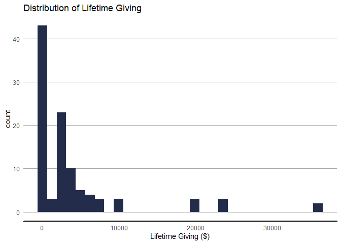
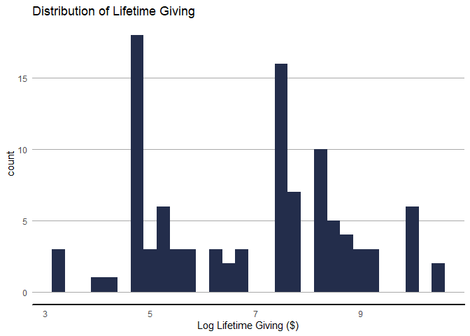

## Background

R Markdown can be a great tool when working through the approach to a new analysis, or troubleshooting (or reverse-engineering) old code. It offers the ability to combine code and prose in a single, self-contained document. As such, an analysts is able to capture the thought process behind the approach. This document will be presented as an example at the [2020 CASE Drive/ Conference](https://www.case.org/drive).

### Approach

In this case, we'd like to identify potential donors in the 2018 fiscal year. We've already pulled the data in question, including giving totals from 2013 to 2017. Data from FY13 to FY16 will be used to predict 2017 donors. The best model will then use data from FY14 to FY17 to predict FY18 donors.

## Data

First, we'll need to obtain the data for the analysis. This anonymized dataset was was originally obtained [here](https://www.kaggle.com/michaelpawlus/fundraising-data), and modified.[^modify]


```r
basicReport <- read_csv(here("Data/basicReport.csv"))
```

There are 300 observations in the data, with 36 columns. 14 of the columns are **numeric**, 3 are **dates**.


### Data Wrangling

#### Age

The `age` variable ranges from 0 to 85. Values of 0 do _not_ make sense, and should be replaced with `NA`. Similarly, `age_bin` can be set to a value of "Unknown".


```r
basicReport <- basicReport %>% 
  mutate(age = if_else(age == 0, NA_real_,age),
         age_bin = if_else(is.na(age),"Unknown",age_bin))
```

#### Factor Variables

Of the 19 text columns above, `age_bin`,`gender`, and `address_type` are more like factors, and should be treated as such. `age_bin` can be an ordered factor, as well.


```r
basicReport <- basicReport %>% 
  mutate_at(vars(gender, address_type),as.factor) %>% 
  mutate(age_bin = factor(age_bin, ordered = T))
```

#### Donor Code

Next, we'll need to adjust the `donor_code` field, which contains 7 different values (Alumni, Non-Degreed; Alumni, Degreed; Alumni, Business School; Alumni, Grad School; Friend; Trustee, Former; Parent, Current).

The `tidyr::separate()` function could be an option here, as it will take a single column and split it into multiple columns.


```r
# This is our first pass at cleaning it up, which ultimately didn't work.
# Setting the code chunk `eval` option to FALSE prevents the chunk from being
# run when creating the report.

basicReport %>% 
  head() %>% 
  separate(donor_code, into = c("type","subtype"))
```

This approach ulitmately didn't work, as "Non-Degreed" was reduced to "Non" (as the string was split on the hyphen.).

Instead, we'll use `forcats::fct_relabel()` to combine some codes into a new factor level.


```r
# Create a functon that keeps lumps alums together, except for Non-Degreed Alumni. 
convertDonor <- function(x) {
 range <- !grepl("Alumni",x) | grepl("Non-Degreed",x)
 
 # Lump all degreed Alums together
 x[!range] <- "Alumni"
 
 # all other types are comma separated. This regular expression reverses these
 # strings (so that the last part is before the first), and removes the comma.
 x[range] <- gsub("(.+), (.+)","\\2 \\1",x[range])
 
 x
}

basicReport <- basicReport %>% 
  mutate(donor_code = fct_relabel(donor_code,convertDonor))
```

This works, as `donor_code` is now a factor with 5 unique values.


## Sampling


```r
trainingPer <- .8
```

In order to measure model performance, we'll need to split the data into _Training_ and _Testing_ sets. 80% of the data will be used for training, and the other 20% will be used for testing.


```r
set.seed(2020)

trainingInd <- sample(nrow(basicReport), nrow(basicReport)*trainingPer)

training <- basicReport[trainingInd,]

testing <- basicReport[-trainingInd,]
```

In the future, we can use the above as a model for a function. It will take three arguments: `df` (the data frame in question), `seed` for the random seed, and `per` for the percentage of observations to use as training.


```r
sampleData <- function(df, per, seed = 2020){
  
  # Basic Error Handling
  stopifnot(inherits(df, "data.frame"))
  
  set.seed(seed)
  
  ind <- sample(nrow(df),nrow(df)*per)
  
  training <-  df[ind,]
  
  testing <- df[-ind,]

  out <- list()
  
  out$training <- training
  out$testing <- testing
  
  
  return(out)
}
```

## EDA


```r
# Rather than copy and past all of the Theme elements for a ggplot2 element,
# save them as a pseudo-function.

customTheme <- theme_minimal() +
  theme(legend.position = "bottom",
        axis.line.x = element_line(size = 1),
        axis.line.y = element_blank(),
        axis.ticks = element_blank(),
        panel.grid.minor = element_blank(),
        panel.grid.major.x = element_blank(),
        panel.grid.major.y = element_line(size = 0.5,
                                          colour = "darkgrey"),
        plot.background = element_rect(fill = "transparent",
                                      color = "transparent"))
```

Before embarking on modelling, we should thoroughly explore the data to identify and correct any potential issues (like missing values, skewed distributions, and outliers).


### Lifetime Giving

Giving amounts tend to adhere to the Pareto principle, where a large percentage of the total dollars raised comes from a small number of donors.


```r
training %>% 
  ggplot(aes(x=lifetime_giving)) +
  geom_histogram(fill="#232D4B") +
  customTheme +
  labs(x = "Lifetime Giving ($)",
       title = "Distribution of Lifetime Giving")
```

<!-- -->

As suspected, the distribution of lifetime giving is heavily skewed to the left. Perhaps a log transformation will help (adding 1 so that there are no values of 0).


```r
training %>% 
  ggplot(aes(x=log(lifetime_giving + 1))) +
  geom_histogram(fill="#232D4B") +
  customTheme +
  labs(x = "Log Lifetime Giving ($)",
       title = "Distribution of Lifetime Giving")
```

<!-- -->

This may be a more appropriate representation of the data for use in modeling.


```r
training <- training %>% 
  mutate(lifetime_giving = log(lifetime_giving + 1))
```


## Analysis

With the data in order, we can start building models. We will consider a Logistic Regression model and other Classification methods.

### Logistic Model

We can build a basic [logistic regression]http://r-statistics.co/Logistic-Regression-With-R.html) model with the `glm()` function.

### Random Forest

Information on the random forest model will go here.

## Session Info

Analysis and Report generated on Windows 10 x64 (build 17763) using R version 3.5.3 (2019-03-11).


```r
# Results = 'asis' renders the output as if it were text in the markdown doc. In
# this case, the script renders as a bulletted list.

# Get a list of attached packages
packages <- sessioninfo::package_info()

# Combine Package name and version number
p <- sprintf("%s (%s)",
             packages$package[packages$attached == T],
             packages$loadedversion[packages$attached == T])

# Iterate over the packages, adding a hypen and space at the start of the string
# (to create a bulletted list) and a new line character at the end of the string
# to list each package as a new bullet point.
for (x in p) {
  cat("- ", x, "\n")
}
```

-  dplyr (0.8.3) 
-  forcats (0.4.0) 
-  ggplot2 (3.2.1) 
-  here (0.1) 
-  janitor (1.1.1) 
-  kableExtra (1.1.0) 
-  knitr (1.28) 
-  readr (1.3.1) 
-  tidyr (0.8.3) 

[^modify]: See `Data\data-raw\createData.R` for the process.


```r
rmarkdown::render(here("Markdown/2-TheTechnical.Rmd"),
                  output_dir = here("Reports"))
```

